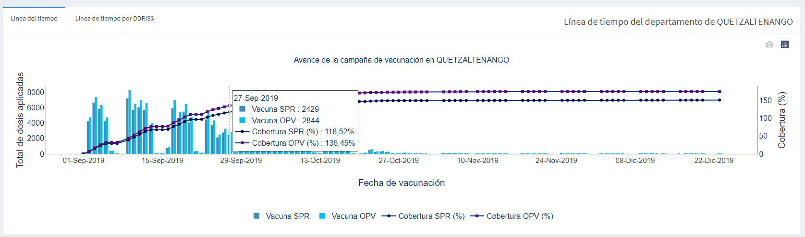
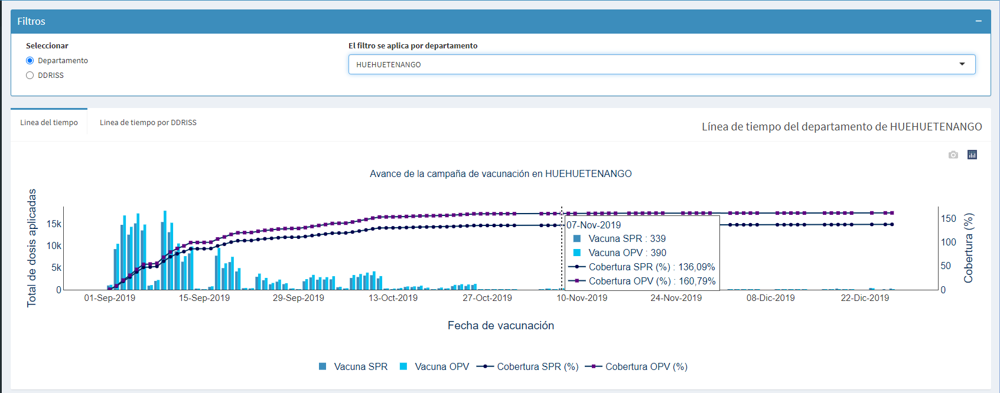
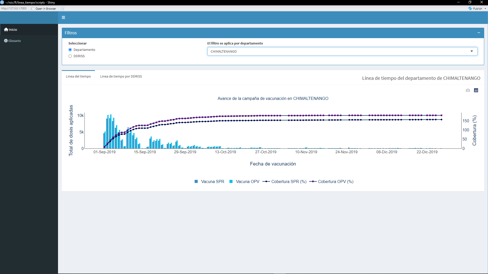

# Linea del tiempo en R
## Descripción
La línea del tiempo es una representación gráfica de una serie de eventos representados en una escala temporal.
La línea del tiempo se ha elaborado en R, un lenguaje de programación y entorno de desarrollo para la realización de cálculos estadísticos y gráficos.

El proposito de la línea del tiempo es mostrar los avances de una campaña de vacunacion en el país de Guatemala, en el cual
se muestra la cantidad de vacunas aplicadas por día, segmentando por tipo de vacuna, además muestra el acumulado en % de la población INE de Guatemala.

## Observaciones
La fuente de datos utilizada para la elaboración de la línea del tiempo es una base de datos de prueba, por lo que los datos no son reales o no reflectan la realidad de la campaña de vacunación en Guatemala pero si se puede observar el comportamiento de la línea del tiempo con respecto a las vacunas aplicadas por día.

## Screenshots
**Línea de tiempo a nivel nacional**

**Línea de tiempo del departamento de Quetzaltenango**

**Línea de tiempo del departamento de Huehuetenango**

**Línea de tiempo del departamento de Chimaltenango**

